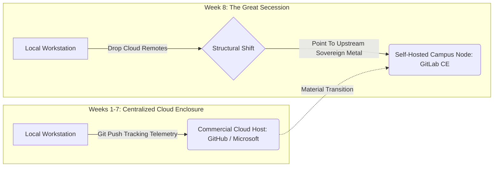

# 🚨 SYSTEM MAINTENANCE NOTICE: Migrating to Sovereign Infrastructure

**To:** All Student Nodes (Developer and Analyst Tracks)  
**Status:** Mandatory Operational Shift  
**Execution Window:** Week 8 (Asynchronous Timeline)

---

## 🏗️ 1. The Operational Shift

For the first seven weeks of this term, our decoupled workspace has been hosted inside Microsoft's cloud infrastructure (GitHub). While this provided a stable onboarding environment, it leaves our aggregate interaction telemetry enclosed within corporate monitoring profiles.

Consistent with our analysis of Audrey Watters’ Skinnerian EdTech critique (Module 2) and Pope Leo XIV's warning against the private enclosure of computing networks (*Magnifica Humanitas*, §66), we are executing a mandatory infrastructure migration. **We are seceding from the commercial cloud.**

We have provisioned an open-core, self-hosted GitLab Community Edition instance running on dedicated campus hardware. 

* **Our Sovereign Server URL:** `https://sovereign-classroom.university.edu`
* **Your Credentials:** Check your inbox via our Out-of-Band Zero-Knowledge Encrypted Portal for your unique account authorization token.

Consistent with Harold Innis’s framework from Module 4, our migration off Microsoft GitHub is an explicit rejection of space-biased imperial networks. For seven weeks, our repository code has been floating through light, hyper-portable commercial cloud channels designed for corporate data harvesting. By transferring our repositories to our local, self-hosted campus server, we are intentionally introducing a heavy, time-biased infrastructure. We are choosing a system that requires local community maintenance, minimizes planetary transmission footprints, and protects the long-term historical continuity of our data within our own physical walls. We are moving from Empire back to Community.



## 🛠️ 2. Your Asynchronous Migration Protocol

Your sole lab task this week is to act as an independent systems administrator. You must safely transport your local workstation's repository history to our self-hosted campus node. Execute these steps precisely inside your local command-line interface:

1. **Initialize Target Target Shell:** Log into our private campus GitLab server using your secure credentials and initialize an empty repository shell under your verified pseudonymous handle.

2. **Map Sovereign Remote Node:** Open your local workstation terminal inside your project directory and link your workspace to the new server address:

   Bash

   ```
   git remote add upstream-sovereign [https://sovereign-classroom.university.edu/your-handle/course-repo.git](https://sovereign-classroom.university.edu/your-handle/course-repo.git)
   ```

3. **Push Cryptographic History:** Execute a full history push to the new node to transport all your branches, commits, and cryptographic signatures:

   Bash

   ```
   git push upstream-sovereign main --tags
   ```

4. **Verify Portability States:** Open your browser interface on our self-hosted server to verify that your markdown files and history migrated perfectly without losing a single line of data history.

## 📥 3. Asynchronous Deliverable: The Post-Migration Issue Log

Once your code lands on our private server, open the **Issue Board** on the new GitLab instance. Submit an entry under the master migration thread detailing:

1. **The Latency & Route Audit:** Run a baseline network route trace (`ping`) from your location against both `github.com` and our private server address. Document the structural variance in your data route times.
2. **The Interface Friction Review:** Document your first impressions of GitLab’s layout compared to GitHub's social feed. Does the lack of commercial attention engineering alter your focus?
3. **The Sovereign Calculation:** Defend whether this act of data sovereignty balances the increased operational responsibility of running a self-hosted server environment.